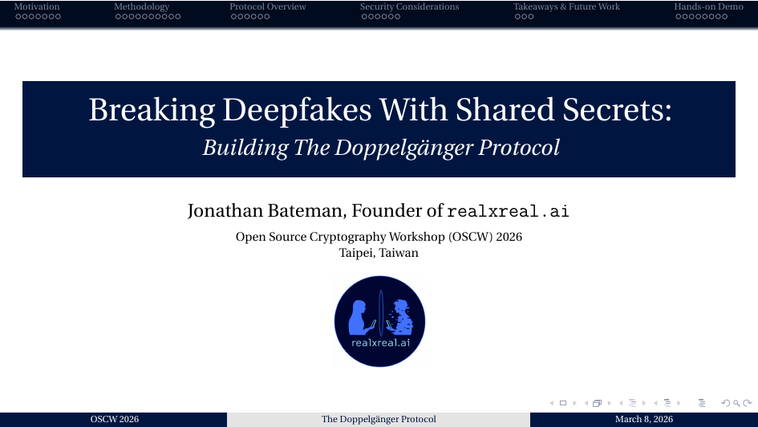

  

<h1 align="center">Breaking Deepfakes With Shared Secrets</h1>

<strong>Building The Doppelgänger Protocol™</strong>

  <a href="https://opensourcecryptowork.shop/2026/index.html"><strong>OSCW 2026 Presentation</strong></a> • 
  <a href="https://www.youtube.com/watch?v=hnRpbijQWjs"><strong>Watch Recording</strong></a> • 
  <a href="https://doppelgangerprotocol.app/verify"><strong>Live Demo Platform</strong></a>

---

## Abstract

**Voice clones fool CEOs into wiring millions. AI-generated video calls scam elderly parents. Traditional authentication like passwords, 2FA, and biometrics can all be faked or phished.**

How do we verify identity when audio, video, and even biometrics are no longer trustworthy? In this hands-on session, we’ll explore **The Doppelgänger Protocol™**: a cryptographic approach that transforms shared human memories into unforgeable authentication keys. We’ll examine how memory-based verification combines challenge-response protocols, local-first cryptography, and zero-knowledge principles to create a new layer of human authentication that AI cannot replicate.

---

## What You'll Learn

* **The Impersonation Paradigm:** Why traditional authentication fails against sophisticated generative deepfake attacks.
* **Episodic Entropy:** How relationship-specific, experiential memory-based challenges create cryptographic proof of shared human experience.
* **Technical Architecture:** Local key generation (via the Web Crypto API), challenge protocols, and preserving privacy with client-side processing.
* **Real-World Threat Models:** De-escalating grandparent scams, executive impersonation, and localized group chat infiltration (e.g., Signal or Matrix).

---

## Interactive Session & Demo

After a focused technical breakdown, session attendees paired up to experience the protocol firsthand using our live browser-based testing environment.

### Try the Live App
You can test the cross-platform cryptographic handshake yourself:
**[Launch Live Verification Client](https://doppelgangerprotocol.app/verify)**

**[View the Source Code](https://github.com/doppelgangerprotocol/doppelganger-web)**

### Protocol Mechanics Tested:
1. **Local Key Generation:** Cryptographic keypairs are generated directly inside the browser session—private keys never leave your local device.
2. **Semantic Verification Gating:** Text answers are mapped into a high-dimensional vector space using a `384-dimension miniLM` embedding model to calculate semantic cosine similarity.
3. **Threshold Release:** The central relay server remains entirely key-blind. Public keys are exchanged if and only if the semantic similarity metric clears the established threshold (e.g., 75%+ Match), neutralizing case sensitivity and minor syntax discrepancies.

---

## Presentation Timeline & Q&A Notes

If you are watching the **[OSCW 2026 Presentation Recording](https://www.youtube.com/watch?v=hnRpbijQWjs)**, use this timeline to skip directly to key technical sections:

* **[00:01:03]** – **Introduction & Security Philosophy:** *"If it's not usable, it's not secure."*
* **[00:02:06]** – **The Identity Binding Problem:** Examining trust breakdowns at the human decision layer over encrypted secure channels.
* **[00:05:22]** – **The Core Insight:** Moving past standard security questions into high-entropy, shared episodic memory agreement.
* **[00:09:54]** – **Mathematical Mapping:** Using Word2Vec concepts and embedding models to test natural language answers.
* **[00:12:31]** – **Step-by-Step Protocol Overview:** Deep dive into the JS Web Crypto API workflow and the session relay mechanism.
* **[00:20:41]** – **Future Roadmap:** Defining the *Memory Entropy Score (MES)* framework and evaluating local on-device client models.
* **[00:22:06]** – **Live Demo Walkthrough:** Real-time console log examination of Alice and Bob completing a handshake.
* **[00:29:49]** – **Q&A Session:** Discussion on preventing "hill-climbing" algorithmic attacks and handling low-entropy memory patterns.

---

## Key Takeaways

* **Verify the Person, Not the Medium:** Stop focusing on the fidelity of the audio/video signal—authenticate the foundational knowledge behind it.
* **The Bootstrapper's Advantage:** Restricting an attacker's infiltration window by implementing an immediate, ephemeral proof-of-knowledge constraint.

---

### Feedback & Contributions
This project represents an ongoing exploration at the intersection of cryptography, machine learning, and human usability. Feedback, peer evaluations, or formal cryptanalysis from the open-source community are highly encouraged.
